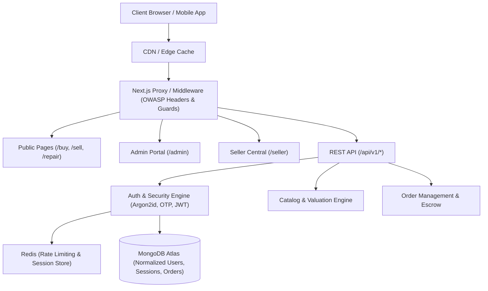

# SELBAR — Enterprise E-Commerce & Recommerce Marketplace

<div align="center">


[-black?style=for-the-badge&logo=next.js)](https://nextjs.org/)
[](https://react.dev/)
[](https://www.typescriptlang.org/)
[](https://www.mongodb.com/atlas)
[](https://tailwindcss.com/)
[](LICENSE)

**India's Next-Generation Recommerce & E-Commerce Platform**  
*Instant Device Valuation • Doorstep Buyback • Certified Refurbished Flagships • Multi-Vendor Marketplace • Mobile Device Diagnostics*

[Live Demo](http://localhost:3000) • [Admin Dashboard](http://localhost:3000/admin) • [Documentation](docs/) • [Architecture](docs/responsive-design-system.md)

</div>

---

## 📖 Table of Contents

1. [Overview & Core Value Propositions](#-overview--core-value-propositions)
2. [Technology Stack](#-technology-stack)
3. [Architecture & System Modules](#-architecture--system-modules)
4. [Enterprise Security & Authentication Suite](#-enterprise-security--authentication-suite)
5. [Mobile-First Responsive Design System](#-mobile-first-responsive-design-system)
6. [Project Structure](#-project-structure)
7. [Environment Configuration](#-environment-configuration)
8. [Installation & Getting Started](#-installation--getting-started)
9. [Admin Dashboard Access](#-admin-dashboard-access)
10. [Automated Security Verification Suite](#-automated-security-verification-suite)
11. [Documentation Library](#-documentation-library)

---

## 🌟 Overview & Core Value Propositions

**SELBAR** is a high-performance recommerce and multi-vendor marketplace designed to scale to **1M+ registered users** and handle high-traffic spike campaigns. The platform facilitates both **single-vendor direct sales** and **multi-vendor store operations** across the circular electronics lifecycle:

* **Sell Old Electronics**: Instant algorithmic price quote, 32-point doorstep diagnostic inspection, and instant UPI bank payouts.
* **Certified Refurbished Store**: 12-month comprehensive warranty, 15-day replacement guarantee, and certified data sanitization certificates (NIST 800-88).
* **Mobile & Laptop Repairs**: Express 30-minute doorstep repair with OEM certified components.
* **Multi-Vendor Seller Central**: Store onboarding, GSTIN verification, warehouse inventory tracking, order milestone progression, and commission analytics.
* **Security Center**: Session device tracking, multi-device revocation, biometric/passkey support, and progressive lockout protection.

---

## 🛠 Technology Stack

| Layer | Technology | Description |
| :--- | :--- | :--- |
| **Frontend Framework** | **Next.js 16.3.5 (Turbopack)** | App Router, React Server Components (RSC), SSR & Static Generation |
| **UI Library** | **React 19.2.8** | Modern Hooks, Transitions, and Concurrent Rendering |
| **Styling & Design** | **Tailwind CSS v4** | CSS Grid & Flexbox, Custom Design Tokens, CSS Media Queries |
| **Icons & Media** | **Lucide React** | Clean, accessible vector iconography |
| **Database** | **MongoDB Atlas / Mongoose 9.10** | Document database with compound indexing, TTL indexes, and normalized schemas |
| **Caching & Rate Limiting** | **Redis (`ioredis`)** | Sliding-window rate limiting, session cache, with resilient in-memory fallback |
| **Password Hashing** | **Argon2id (OWASP)** | 64MB memory cost, 3 iterations, 4 parallelism, with automatic bcrypt migration |
| **Authentication** | **JWT + HttpOnly Cookies** | In-memory 15-min Access Tokens + Rotating Refresh Tokens with reuse detection |
| **Validation** | **Zod v4** | Strict server-side and client-side input validation and normalization |
| **Testing** | **TSX / Node Test Suite** | 34-point automated unit and integration verification suite |

---

## 🏗 Architecture & System Modules



---

## 🔐 Enterprise Security & Authentication Suite

The authentication system is built to the highest OWASP and financial-grade standards:

1. **Dual-Token Architecture**:
   * **Access Tokens**: Short-lived (15 minutes), signed with HMAC-SHA256, stored strictly in memory via `tokenBridge.ts`. **Zero tokens in `localStorage`**.
   * **Refresh Tokens**: Long-lived, stored in `HttpOnly`, `SameSite: 'lax'`, `Secure` cookies with SHA-256 hashed persistence in MongoDB.
2. **Token Rotation & Reuse Detection**:
   * Every refresh operation consumes the current refresh token and issues a new one.
   * If a previously used refresh token is replayed, the system detects a token hijacking attempt and **immediately revokes the entire session family**.
3. **Single-Flight Refresh Mutex**:
   * `tokenBridge.ts` coordinates concurrent API requests during token expiration, ensuring only **one** refresh request hits the server to prevent race-condition family invalidation.
4. **Argon2id Password Security**:
   * Evaluated with OWASP recommended parameters (64MB memory, 3 iterations, 4 parallelism).
   * Transparent backward compatibility for legacy bcrypt hashes with **silent upgrade on successful login**.
5. **Cryptographic OTP Engine**:
   * 6-digit cryptographically random OTPs (`crypto.randomInt`).
   * Stored as peppered HMAC-SHA256 hashes (`OTP_HMAC_SECRET`).
   * Compared in **constant time** via `crypto.timingSafeEqual` to eliminate timing side-channel attacks.
   * Enforces 5-minute expiration, 60-second cooldown, and a maximum of 5 attempts.
6. **Multi-Vendor IDOR / BOLA Prevention**:
   * `verifySellerResourceOwnership()` middleware strictly verifies tenant authorization server-side, preventing sellers from accessing or manipulating other vendors' resources.
7. **Defense-in-Depth HTTP Security Headers**:
   * Content Security Policy (CSP), Strict-Transport-Security (HSTS), X-Frame-Options (`DENY`), X-Content-Type-Options (`nosniff`), Referrer-Policy, and Permissions-Policy.

---

## 📱 Mobile-First Responsive Design System

The platform implements a **Mobile-First CSS strategy** while **strictly preserving the existing desktop design with zero visual or layout differences at 1024px and above**:

* **Mobile (0px – 767px)**: Fluid 1-2 column layout, full-width search, slide-over drawer, persistent 5-button thumb navigation bar.
* **Tablet (768px – 1023px)**: Adaptive 2-4 column grid, horizontal scroll carousels, collapsible navigation.
* **Desktop (1024px+)**: **100% pixel-perfect match** to the original desktop specification: full multi-tier mega navigation, central search bar, and multi-column grid layouts.
* **Touch-Friendly Tap Targets**: Minimum 44×44px interactive targets adhering to WCAG 2.5.5 and Apple HIG.
* **iOS Safari Auto-Zoom Prevention**: Enforces 16px minimum font size on mobile inputs to eliminate automatic viewport distortion.
* **Modern Safe-Area Insets**: Incorporates `env(safe-area-inset-bottom)` for bezel-less mobile screens (iPhone Dynamic Island / Android gesture bars).
* **Zero Horizontal Overflow**: Guaranteed across all devices from 320px up to 4K displays.

---

## 📁 Project Structure

```text
SELBAR/Website/
├── docs/                               # Comprehensive Documentation
│   ├── authentication.md               # Auth architecture & flow diagrams
│   ├── rbac.md                         # Role & Permission matrix
│   ├── responsive-design-system.md     # Mobile-first breakpoint guide
│   ├── session-management.md           # Token rotation & session revocation
│   └── threat-model.md                 # Security threat & mitigation analysis
├── public/                             # Public static assets & brand SVG graphics
├── src/
│   ├── app/                            # Next.js App Router Pages & API Routes
│   │   ├── (public)/                   # Home, Buy, Sell, Repair, Stores
│   │   ├── account/                    # User Account & Security Center
│   │   ├── admin/                      # Operations & Inventory Control
│   │   ├── api/v1/                     # REST API Endpoints
│   │   │   ├── admin/                  # Admin API Keys & Configuration
│   │   │   ├── auth/                   # Login, Register, Refresh, OTP, Sessions
│   │   │   ├── catalog/                # Product catalog & pricing quotes
│   │   │   └── orders/                 # Buy & Sell order pipelines
│   │   ├── login/ & register/          # Dedicated responsive authentication portals
│   │   ├── globals.css                 # Design tokens & responsive CSS rules
│   │   └── layout.tsx                  # Root layout, fonts, and viewport meta
│   ├── components/                     # Reusable React UI Components
│   │   ├── auth/                       # PasswordStrengthMeter, SmartCredentialInput
│   │   ├── common/                     # BrandMarquee, FaqSection, Guide
│   │   ├── home/                       # Hero Slider, LiveActivityTicker, Reviews
│   │   ├── layout/                     # Header, Mega Nav, Drawer, Footer
│   │   └── seller/                     # OnboardingWizard, FilterSidebar
│   ├── context/                        # React Context Providers
│   │   ├── AuthContext.tsx             # Auth lifecycle, silent token restoration
│   │   ├── CartContext.tsx             # Shopping cart state & local storage
│   │   └── ThemeContext.tsx            # Theme tokens & styling preferences
│   ├── lib/                            # Business Logic & Infrastructure
│   │   ├── auth/                       # Security & Session Infrastructure
│   │   │   ├── middleware/             # Role, permission, and anti-IDOR guards
│   │   │   ├── security/               # Argon2id hasher, OTP engine, Redis client
│   │   │   ├── jwt.ts                  # Access/Refresh token signing & verification
│   │   │   └── tokenBridge.ts          # In-memory token manager & single-flight mutex
│   │   ├── db/                         # Database & Mongoose Models
│   │   │   ├── models/                 # User, Session, Seller, Role, Order, Product
│   │   │   └── mongodb.ts              # MongoDB Atlas connection manager
│   │   └── validators/                 # Zod validation schemas
│   ├── middleware.ts                   # Next.js Route Guard & OWASP Security Headers
│   └── scripts/                        # Management & Verification Scripts
│       ├── seedAdminUser.ts            # Super Admin account seeder
│       └── testAuthSuite.ts            # Automated security verification test suite
├── next.config.ts                      # Next.js & remote image configuration
├── package.json                        # Scripts & dependencies
└── tsconfig.json                       # TypeScript compiler configuration
```

---

## ⚙️ Environment Configuration

Create a `.env.local` file in the root directory based on `.env.example`:

```env
# Application
NODE_ENV=development
PORT=3000
FRONTEND_URL=http://localhost:3000

# Database (MongoDB Atlas)
MONGO_URI=mongodb+srv://<username>:<password>@<cluster>.mongodb.net/selbar?retryWrites=true&w=majority

# Redis Cache (Optional - in-memory fallback enabled automatically)
REDIS_URL=redis://localhost:6379

# JWT Cryptographic Secrets (Generate via `openssl rand -hex 48`)
JWT_ACCESS_SECRET=your_384_bit_access_secret
JWT_REFRESH_SECRET=your_384_bit_refresh_secret
OTP_HMAC_SECRET=your_384_bit_otp_pepper_secret

# Master Admin In-House API Key
SELBAR_MASTER_API_KEY=selbar_live_sk_master_6413ad35e13902f58a665a63a3d9d38dac61c19dba79c430
```

---

## 🚀 Installation & Getting Started

### 1. Clone & Install Dependencies
```bash
git clone https://github.com/maajankiweb/Sellbar-Ecommerce.git
cd Sellbar-Ecommerce/Website
npm install
```

### 2. Seed the Super Administrator Account
```bash
npm run seed:admin
```

### 3. Run the Automated Security Verification Suite
```bash
npm run test:auth
```

### 4. Start the Development Server
```bash
npm run dev
```
Open [http://localhost:3000](http://localhost:3000) in your browser.

### 5. Build for Production
```bash
npm run build
npm run start
```

---

## 🔑 Admin Dashboard Access

A **Super Administrator** account is provisioned in the database with full root privileges:

| Parameter | Default Value |
| :--- | :--- |
| **Login Portal** | [http://localhost:3000/login](http://localhost:3000/login) |
| **Admin Operations Dashboard** | [http://localhost:3000/admin](http://localhost:3000/admin) |
| **Identifier (Email / Username)** | `admin@selbar.in` or `admin` |
| **Password** | `Admin@Selbar2026!` |
| **Access Tier** | `super_admin` (Full root access across orders, products, and tenants) |

> [!NOTE]  
> To update or reset the admin password at any time, run:
> ```bash
> npm run seed:admin
> ```

---

## 🧪 Automated Security Verification Suite

Run the automated verification suite to execute 34 unit and integration tests across all cryptography and session modules:

```bash
npm run test:auth
```

```text
====================================================
  SELBAR AUTHENTICATION & SECURITY TEST SUITE       
====================================================

[1/4] Testing Password Hashing & Verification (Argon2id + Bcrypt Migration)...
  ✓ PASS: Hash uses Argon2id algorithm
  ✓ PASS: Argon2id correct password verifies successfully
  ✓ PASS: Fresh Argon2id does not require rehash
  ✓ PASS: Argon2id wrong password fails verification
  ✓ PASS: Legacy hash uses bcrypt format
  ✓ PASS: Legacy bcrypt hash verifies successfully
  ✓ PASS: Legacy bcrypt hash correctly flags needsRehash=true for silent Argon2id upgrade

[2/4] Testing Cryptographic OTP Generation & Verification Lifecycle...
  ✓ PASS: OTP is exactly 6 numerical digits
  ✓ PASS: OTP is in valid 100000-999999 range
  ✓ PASS: Deterministic HMAC-SHA256 hash across identical OTP strings
  ✓ PASS: OTP hash is 256-bit hex (SHA-256 HMAC)
  ✓ PASS: Timing-safe comparison confirms identical HMAC hashes
  ✓ PASS: createAndStoreOtp creates record
  ✓ PASS: Generated OTP returned to dispatcher
  ✓ PASS: verifyStoredOtp correctly rejects wrong code
  ✓ PASS: verifyStoredOtp successfully validates correct code

[3/4] Testing JWT Token Generation, Payload, & Verification...
  ✓ PASS: Access token is a valid JWT
  ✓ PASS: Access token decodes successfully
  ✓ PASS: Token payload contains correct userId
  ✓ PASS: Token payload contains tenant sellerId
  ✓ PASS: Token payload contains correct primary role
  ✓ PASS: Refresh token is a valid JWT
  ✓ PASS: Refresh token SHA-256 hash is generated for database storage
  ✓ PASS: Refresh token decodes correctly

[4/4] Testing Zod Security Validation & Normalization Schemas...
  ✓ PASS: normalizeMobileNumber formats 10-digit number correctly
  ✓ PASS: normalizeEmail cleans whitespace and lowercases
  ✓ PASS: normalizeUsername normalizes casing
  ✓ PASS: Valid registration payload passes Zod validation
  ✓ PASS: Weak password fails Zod validation
  ✓ PASS: Malicious XSS username fails Zod validation
  ✓ PASS: Valid login payload passes Zod validation
  ✓ PASS: Empty password fails login Zod validation
  ✓ PASS: Matching new passwords pass ChangePasswordSchema
  ✓ PASS: Mismatched new passwords fail ChangePasswordSchema

====================================================
  FINAL VERIFICATION: 34 PASSED, 0 FAILED
====================================================
```

---

## 📚 Documentation Library

Detailed engineering documentation is available in the [`docs/`](docs/) directory:

* [**Authentication & Authorization Guide**](docs/authentication.md): Dual-token architecture, silent renewal, and security flows.
* [**Role-Based Access Control (RBAC) Matrix**](docs/rbac.md): Hierarchy, permissions, and multi-vendor tenant boundary enforcement.
* [**Session Management & Revocation**](docs/session-management.md): Token family rotation, concurrent device limits, and Security Center.
* [**Threat Model & Mitigation Strategy**](docs/threat-model.md): Comprehensive analysis of OWASP Top 10 mitigations and defense layers.
* [**Responsive Design System & Breakpoints**](docs/responsive-design-system.md): Mobile-first progressive enhancement and desktop design preservation.

---

<div align="center">
  <b>SELBAR Technologies India Pvt. Ltd.</b> • Built for Performance, Trust, and Circular Recommerce.
</div>
